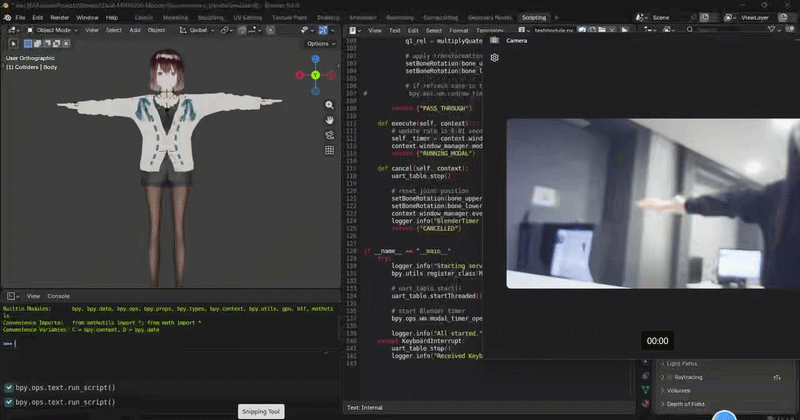

# WT901BLE Based Arm Motion Capture to Blender

A lightweight implementation for real-time arm motion capture using the **WT901BLE (Bluetooth Low Energy)** sensor. This project bridges hardware orientation data with Blender armatures via a virtual serial port bridge.

## 🔗 Credits
This project is inspired by the logic from [T-K-233/Dual-MPU6050-Motion-Sync](https://github.com/T-K-233/Dual-MPU6050-Motion-Sync).

---

## 🔄 System Architecture

The data flows from the physical sensor to the Blender 3D environment via a virtual COM bridge:

### Data Pipeline:
1. **WT901BLE Sensor**: Captures 9-axis physical motion (Quaternions).
2. **Python SDK**: Reads data via BLE 5.0 using the WIT open-source SDK.
3. **Virtual Serial Bridge**: 
   - **COM1**: Python script writes orientation data.
   - **COM2**: Blender's `pyserial` script receives the data.
4. **Blender Environment**: Updates bone transforms using the `bpy` API in real-time.

---

## 📺 Demo

---

## 🛠 Tech Stack
* **Hardware**: WT901BLE (IMU)
* **Language**: Python 3.x
* **Communication**: BLE 5.0 + Virtual Serial Port (VSPD)
* **Software**: Blender 5.1

## License
MIT
